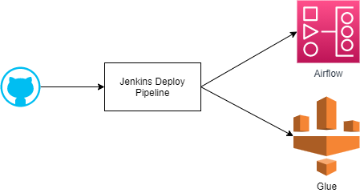

# CEDC
## Backgroud
This project is aiming to build a whole cloud based DevOps ETL process. Include below Parts:
1. Cloud Infrastructure
2. Airflow framework
3. Jenkins Devops Pipeline
4. Glue ETL jobs
5. IAM Roles Management

## Project Name
**C**loud base **E**TL **D**evOps process of **C**ognizant = **CEDC**

## Architecture
WIP

## Cloud Infrastructure
### Account distribution 
- Account A: this is a DevOps account mainly include Jenkins and Airflow
- Account B: this is a data lake account mainly include S3
- Account C: this is a ETL account mainly include Glue, Lambda etc
- Account D: this is a Identity account which can assume A/B/C accounts by **User role** or **Admin Role**

**Note**: in the first draft, we can centralized deploy all services into one account for demo purpose.

## Airflow framework
### Features
- Parameter driven framework:
- Scheduling by Airflow:
- Job Rerun ability: idempotence? catchup ? true/false ? need to discuss 
- Onboarding/Off Boarding:
- Jobs Stats:
- Email Notifications:

start_batch.py  HIST EMIAL=Y table_name, xxx.xxxdfsdfsd

## Jenkins Devops Pipeline
Deploy airflow dags and glue job in project

## Glue ETL jobs
### Account prerequisite
### Standard aws serverless account with below items:
- Glue
- Lambda
- S3
- Cloudwatch Events
- Cloudwatch logs
- Secrets manager
- wip ...

### Glue
Glue job naming standard: 
- <project_name>_<table_name or process_name>_prelanding
- <project_name>_<table_name or process_name>_landing
- <project_name>_<table_name or process_name>_landing_merge
- <project_name>_<table_name or process_name>_refinement
- <project_name>_<table_name or process_name>_publish

## IAM Roles Management
1. Account C: Glue Job Execution role -> **DEVOPS_GLUE_CEDC_EXECUTION** (cross account role to ensure Airflow can trigger glue jobs on Account C)
2. Account C Viewer/Admin role: **DEVOPS_GLUE_CEDC_READ**/**DEVOPS_GLUE_CEDC_ADMIN** (Readonly or Admin)
3. Account A: CICD Role: **DEVOPS_CICD_CEDC** (which will assume admin access for all accounts for now.)
4. Account B: **DEVOPS_S3_CEDC_READ**/**DEVOPS_S3_CEDC_ADMIN**
